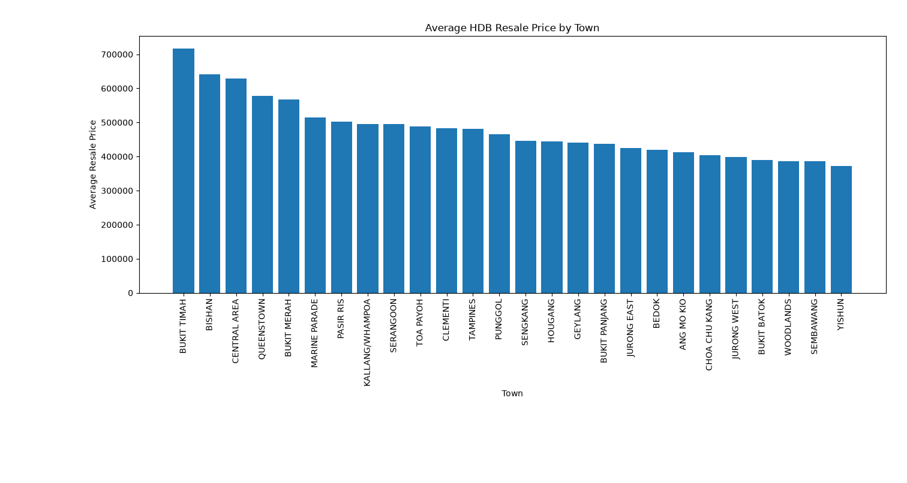
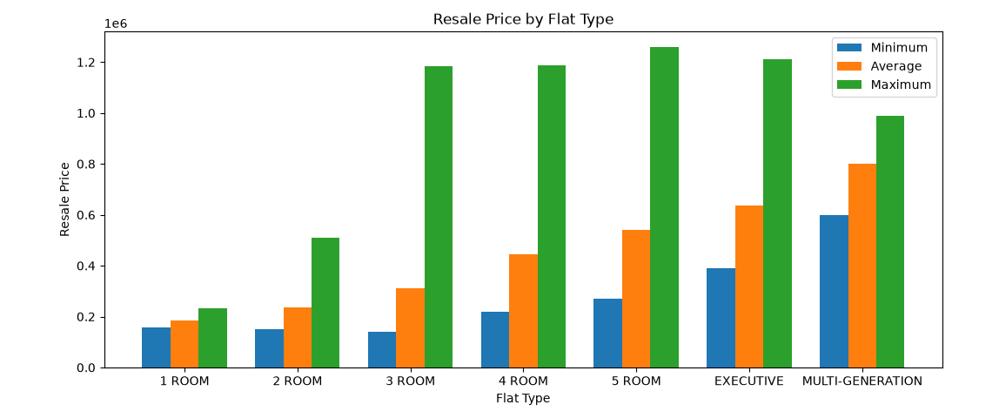
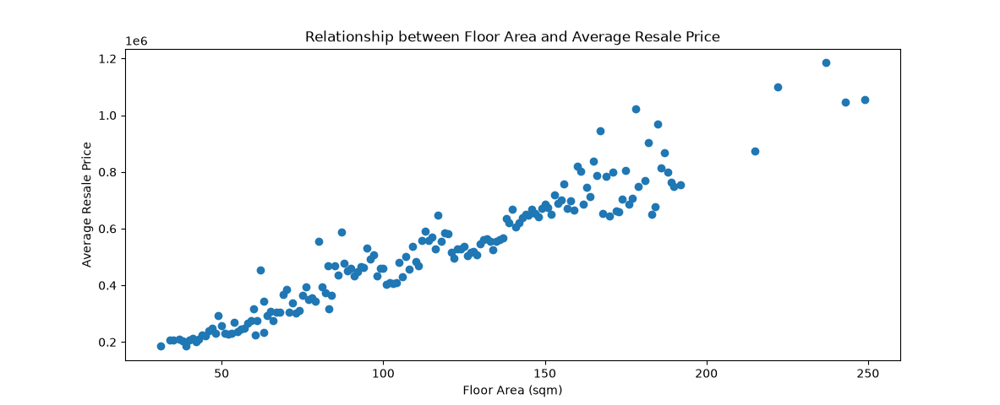
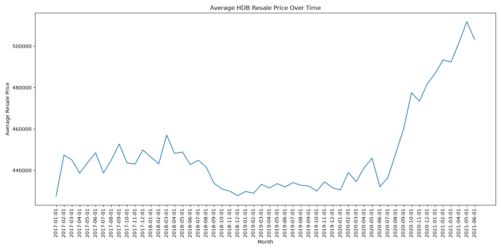
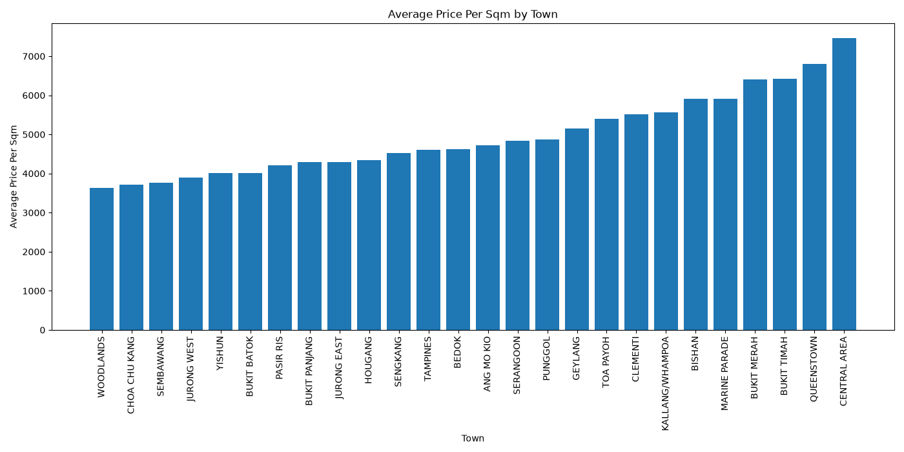

# HDB Resale Data Analysis

## Project Overview

This project analyses HDB resale flat transactions in Singapore using Python, Pandas, SQL and SQLite. The project retrieves data from the HDB resale flat dataset, cleans and stores the data in a SQLite database, and uses SQL queries and visualisations to identify patterns in resale prices.

## Data Pipeline

API → Python → Pandas → SQLite → SQL → Visualisation

## Data Source & Collection

The project uses the HDB resale flat transactions dataset provided through Singapore's data.gov.sg API.

The data was retrieved using Python's `requests` library. Since the API limits the number of records returned in a single request, pagination was used to retrieve the data in batches. Each request retrieves 10,000 records, with the `offset` increasing after each request, up to a maximum of 100,000 records.

The retrieved records are combined into a Pandas DataFrame before being cleaned and stored in a SQLite database.

## Data Cleaning & Preparation

The retrieved data was cleaned using Pandas before being stored in the SQLite database.

The following preprocessing steps were performed:

- Converted `resale_price` to a numeric data type.
- Converted `floor_area_sqm` to a numeric data type.
- Converted `lease_commence_date` to a numeric data type.
- Converted `month` from a string to a datetime format.
- Stored the cleaned data in a SQLite database for SQL analysis.

## SQL Analysis

The cleaned data was stored in a SQLite database and analysed using SQL queries. The analysis focused on five questions:

1. Which towns have the highest average resale prices?
2. How does resale price vary across different flat types?
3. Does a larger floor area generally correspond to a higher resale price?
4. How have HDB resale prices changed over time?
5. Which towns offer the best value based on resale price per square metre?

The analysis uses SQL concepts including:

- `GROUP BY`
- Aggregate functions such as `AVG()`, `MIN()`, `MAX()` 
- `ROUND()`
- `ORDER BY`
- Calculated metrics

## Visualisations & Key Findings

### 1. Average Resale Price by Town

**Key finding:** Bukit Timah had the highest average resale price among the towns analysed, while Yishun had the lowest. This shows that average resale prices can vary significantly across different towns.

### 2. Average Resale Price by Flat Type

**Key finding:** Resale price generally rises with flat type, with the average increasing from about $185k (1-room) to about $800k (multi-generation). The anomaly is the maximum price: it jumps to about $1.19M at 3-room and stays at about $1.2M up to Executive instead of rising steadily, then drops to about $990k for multi-generation. The minimum price is also unusual, staying flat at about $140k to $157k from 1-room to 3-room before climbing sharply.

### 3. Average Resale Price by Floor Area

**Key finding:** The scatter plot showed an overall upward relationship between floor area and resale price. This suggests that larger flats generally have higher resale prices, although floor area is not the only factor affecting price.

### 4. Average Resale Price Over Time

**Key finding:** Average HDB resale price fluctuated within a narrow range in 2017 and early 2018, then dipped and stayed flat and stable through 2019. From mid-2020 it rose sharply and steadily to a peak in May 2021. The anomalies are the sudden dip in mid-2020 just before the surge, and the slight drop in the final month after the peak.

### 5. Average Resale Price per Square Metre by Town

**Key finding:** Average price per sqm rises steadily from town to town, from about $3,600 in the cheapest towns (e.g. Woodlands) to about $7,500 in the Central Area. Prices climb gradually through the middle towns, then jump more sharply at the top end, with Queenstown and the Central Area standing out as the most expensive.

## Technologies Used
- **Python** — Data retrieval, cleaning and analysis
- **Pandas** — Data manipulation and preprocessing
- **Requests** — Retrieving data from the API
- **SQLite** — Storing and querying the dataset
- **SQL** — Data analysis and aggregation
- **Matplotlib** — Data visualisation

## What I Learned

Through this project, I gained hands-on experience in:

- Working with APIs and handling paginated data retrieval.
- Cleaning and preparing real-world datasets using Pandas.
- Storing structured data in a SQLite database.
- Writing SQL queries to analyse and aggregate data.
- Creating visualisations to communicate findings.
- Building a complete data pipeline from data collection to analysis.